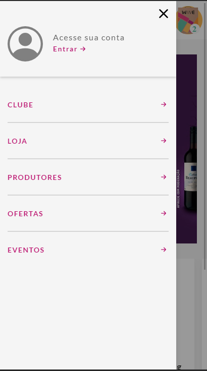
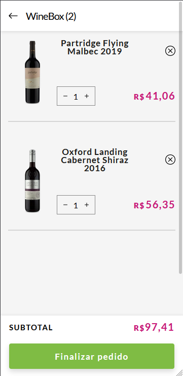

# Vinheira VuE





Projeto realizado com o objetivo de concluir um teste para uma vaga, o <a href="https://www.figma.com/file/YRI1hSz0WU6oVSvG7vcTxH/Teste-Front-end?node-id=1%3A172">layout proposto</a>,<a href="https://eloquent-banach-340ca1.netlify.app/">layout entregue</a>.

### Implementado

- [x] mini cart 
- [x] listagem de produtos 
- [x] menu resposivo 

## 💻 Pré-requisitos

Antes de começar, verifique se você atendeu aos seguintes requisitos:

* Você instalou a versão mais recente de `<linguagem / dependência / requeridos>`
* Você tem uma máquina `<Windows / Linux / Mac>`. Indique qual sistema operacional é compatível / não compatível.
* Você leu `<guia / link / documentação_relacionada_ao_projeto>`.

## 🚀 Instalando Vinheira VuE

Para instalar o Vinheira VuE, siga estas etapas:

Linux ,MacOS e Windows:
```
Project setup
npm install
```
```
Compiles and hot-reloads for development
npm run serve
```
```
Compiles and minifies for production
npm run build
```


## 📫 Contribuindo para Vinheira VuE
Para contribuir com Vinheira VuE, siga estas etapas:

1. Bifurque este repositório.
2. Crie um branch: `git checkout -b <nome_branch>`.
3. Faça suas alterações e confirme-as: `git commit -m '<mensagem_commit>'`
4. Envie para o branch original: `git push origin <nome_do_projeto> / <local>`
5. Crie a solicitação de pull.

Como alternativa, consulte a documentação do GitHub em [como criar uma solicitação pull](https://help.github.com/en/github/collaborating-with-issues-and-pull-requests/creating-a-pull-request).

## 🤝 Colaboradores

Agradecemos às seguintes pessoas que contribuíram para este projeto:

<table>
  <tr>
    <td align="center">
      <a href="https://github.com/EdsonMateus1">
        <br>
        <sub>
          <b>Edson Mateus</b>
        </sub>
      </a>
    </td>
  </tr>
</table>

